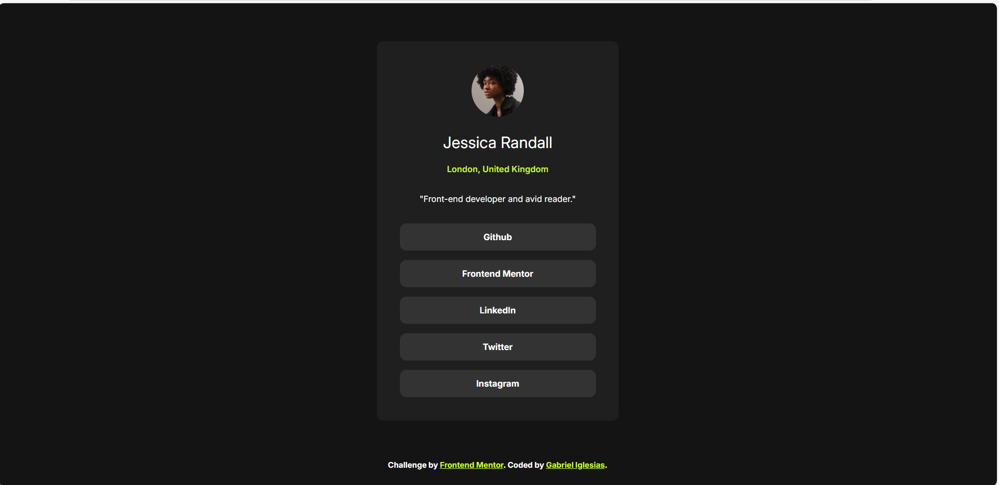

# Frontend Mentor - Social links profile solution

This is a solution to the [Social links profile challenge on Frontend Mentor](https://www.frontendmentor.io/challenges/social-links-profile-UG32l9m6dQ). Frontend Mentor challenges help you improve your coding skills by building realistic projects.

### The challenge

Users should be able to:

- See hover and focus states for all interactive elements on the page

### Screenshot

### Links

- Solution URL: https://www.frontendmentor.io/solutions/social-links-profile-using-only-html-and-css-3pCLJ6IuJk
- Live Site URL: https://social-links-profile-frme.netlify.app/

## My process

### Built with

- HTML
- CSS
- NO AI NEEDED!!!!

## Author

- Website - https://gabrieliglesias.netlify.app/
- Frontend Mentor - [@iglesiasgm] https://www.frontendmentor.io/profile/iglesiasgm
- LinkedIn - [Gabriel Iglesias] https://www.linkedin.com/in/gabriel-mariano-iglesias-834767239/?trk=opento_sprofile_details
- Github - [@iglesiasgm] https://github.com/iglesiasgm
